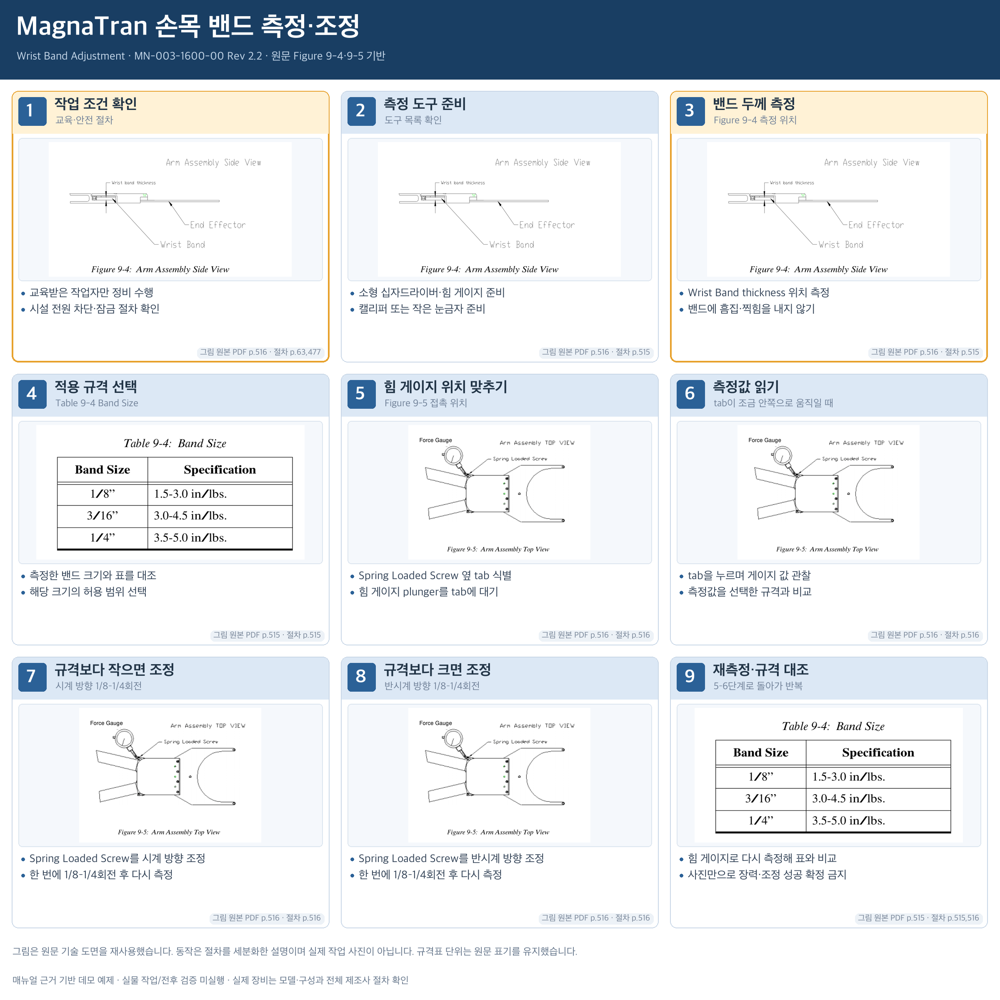

# MagnaTran 손목 밴드 측정·조정

Wrist Band Adjustment 섹션의 측정·조정·재측정 루프 전체. 시설 안전 절차는 발췌본만으로 대체하지 않음.

## 그림 사용 방식

원문 figure/photo를 그대로 발췌·축소하여 카드에 배치했다. 그림 형상, 배선, LED 상태 및 도구 위치를 변경하지 않았다. 텍스트로 설명하는 동작은 원문 절차를 세분화한 것이며 새로운 작업 사진을 생성하지 않았다.

## 단계별 설명

### 1. 작업 조건 확인 · 교육·안전 절차

- 교육받은 작업자만 정비 수행
- 시설 전원 차단·잠금 절차 확인

그림: 원본 PDF 516쪽 / 절차: [63, 477]

### 2. 측정 도구 준비 · 도구 목록 확인

- 소형 십자드라이버·힘 게이지 준비
- 캘리퍼 또는 작은 눈금자 준비

그림: 원본 PDF 516쪽 / 절차: [515]

### 3. 밴드 두께 측정 · Figure 9-4 측정 위치

- Wrist Band thickness 위치 측정
- 밴드에 흠집·찍힘을 내지 않기

그림: 원본 PDF 516쪽 / 절차: [515]

### 4. 적용 규격 선택 · Table 9-4 Band Size

- 측정한 밴드 크기와 표를 대조
- 해당 크기의 허용 범위 선택

그림: 원본 PDF 515쪽 / 절차: [515]

### 5. 힘 게이지 위치 맞추기 · Figure 9-5 접촉 위치

- Spring Loaded Screw 옆 tab 식별
- 힘 게이지 plunger를 tab에 대기

그림: 원본 PDF 516쪽 / 절차: [516]

### 6. 측정값 읽기 · tab이 조금 안쪽으로 움직일 때

- tab을 누르며 게이지 값 관찰
- 측정값을 선택한 규격과 비교

그림: 원본 PDF 516쪽 / 절차: [516]

### 7. 규격보다 작으면 조정 · 시계 방향 1/8–1/4회전

- Spring Loaded Screw를 시계 방향 조정
- 한 번에 1/8–1/4회전 후 다시 측정

그림: 원본 PDF 516쪽 / 절차: [516]

### 8. 규격보다 크면 조정 · 반시계 방향 1/8–1/4회전

- Spring Loaded Screw를 반시계 방향 조정
- 한 번에 1/8–1/4회전 후 다시 측정

그림: 원본 PDF 516쪽 / 절차: [516]

### 9. 재측정·규격 대조 · 5–6단계로 돌아가 반복

- 힘 게이지로 다시 측정해 표와 비교
- 사진만으로 장력·조정 성공 확정 금지

그림: 원본 PDF 515쪽 / 절차: [515, 516]

## 범위와 해석

- 이 예제는 원문 근거를 보여주는 오프라인 스토리보드다. 실제 장비의 안전/정상 동작을 승인하지 않는다.
- 같은 그림이 여러 카드에 반복되어도 수행 전후 상태라는 뜻은 아니다.
- 원문 PDF 페이지와 발췌 PDF의 페이지는 storyboard-source.json의 page_map으로 구분한다.
- 장비 등록/source_url 검증/실물 평가/9패널 계약 적용/앱 구현 및 통합은 orchestrator 후속 범위다.

- 카드 7·8은 동시에 수행하는 연속 단계가 아니라 측정값에 따른 분기다. 조정 후 카드 5·6으로 돌아간다.
- 힘 게이지 사양과 Table 9-4 단위는 원문 in/lbs. 표기를 그대로 유지하며 임의의 N 또는 N·m 변환을 하지 않았다.
- Figure 9-4의 흐린 선 및 Figure 9-5의 저해상도는 원문 품질이다. 새 세부사항을 생성해 보충하지 않았다.
