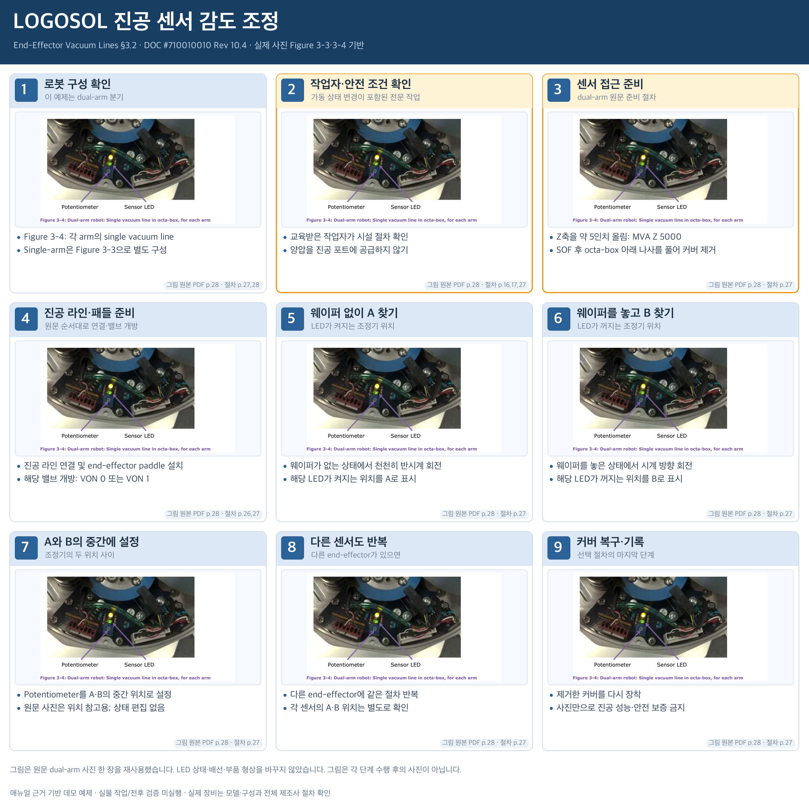

# LOGOSOL 진공 센서 감도 조정

§3.2 시작부터 센서 감도 조정·다른 센서 반복·커버 복구까지 포함. 이 보드는 dual-arm 분기를 예시로 사용.

## 그림 사용 방식

원문 figure/photo를 그대로 발췌·축소하여 카드에 배치했다. 그림 형상, 배선, LED 상태 및 도구 위치를 변경하지 않았다. 텍스트로 설명하는 동작은 원문 절차를 세분화한 것이며 새로운 작업 사진을 생성하지 않았다.

## 단계별 설명

### 1. 로봇 구성 확인 · 이 예제는 dual-arm 분기

- Figure 3-4: 각 arm의 single vacuum line
- Single-arm은 Figure 3-3으로 별도 구성

그림: 원본 PDF 28쪽 / 절차: [27, 28]

### 2. 작업자·안전 조건 확인 · 가동 상태 변경이 포함된 전문 작업

- 교육받은 작업자가 시설 절차 확인
- 양압을 진공 포트에 공급하지 않기

그림: 원본 PDF 28쪽 / 절차: [16, 17, 27]

### 3. 센서 접근 준비 · dual-arm 원문 준비 절차

- Z축을 약 5인치 올림: MVA Z 5000
- SOF 후 octa-box 아래 나사를 풀어 커버 제거

그림: 원본 PDF 28쪽 / 절차: [27]

### 4. 진공 라인·패들 준비 · 원문 순서대로 연결·밸브 개방

- 진공 라인 연결 및 end-effector paddle 설치
- 해당 밸브 개방: VON 0 또는 VON 1

그림: 원본 PDF 28쪽 / 절차: [26, 27]

### 5. 웨이퍼 없이 A 찾기 · LED가 켜지는 조정기 위치

- 웨이퍼가 없는 상태에서 천천히 반시계 회전
- 해당 LED가 켜지는 위치를 A로 표시

그림: 원본 PDF 28쪽 / 절차: [27]

### 6. 웨이퍼를 놓고 B 찾기 · LED가 꺼지는 조정기 위치

- 웨이퍼를 놓은 상태에서 시계 방향 회전
- 해당 LED가 꺼지는 위치를 B로 표시

그림: 원본 PDF 28쪽 / 절차: [27]

### 7. A와 B의 중간에 설정 · 조정기의 두 위치 사이

- Potentiometer를 A·B의 중간 위치로 설정
- 원문 사진은 위치 참고용; 상태 편집 없음

그림: 원본 PDF 28쪽 / 절차: [27]

### 8. 다른 센서도 반복 · 다른 end-effector가 있으면

- 다른 end-effector에 같은 절차 반복
- 각 센서의 A·B 위치는 별도로 확인

그림: 원본 PDF 28쪽 / 절차: [27]

### 9. 커버 복구·기록 · 선택 절차의 마지막 단계

- 제거한 커버를 다시 장착
- 사진만으로 진공 성능·안전 보증 금지

그림: 원본 PDF 28쪽 / 절차: [27]

## 범위와 해석

- 이 예제는 원문 근거를 보여주는 오프라인 스토리보드다. 실제 장비의 안전/정상 동작을 승인하지 않는다.
- 같은 그림이 여러 카드에 반복되어도 수행 전후 상태라는 뜻은 아니다.
- 원문 PDF 페이지와 발췌 PDF의 페이지는 storyboard-source.json의 page_map으로 구분한다.
- 장비 등록/source_url 검증/실물 평가/9패널 계약 적용/앱 구현 및 통합은 orchestrator 후속 범위다.

- dual-arm 분기를 기준으로 Figure 3-4를 사용한다. single-arm 사진은 참고 자료에만 포함하며 전후 상태로 연결하지 않는다.
- MVA Z 5000 → SOF → 커버 접근 → 진공/밸브 → 감도 조정의 원문 순서를 보존한다. 조정 단계에는 전원이 필요한 동작이 있어 전 과정 전원 OFF로 표현하지 않는다.
- 실제 감도 시험은 전문 작업이다. 원문 센서 LED 사진을 ON/OFF로 편집하지 않았다.
