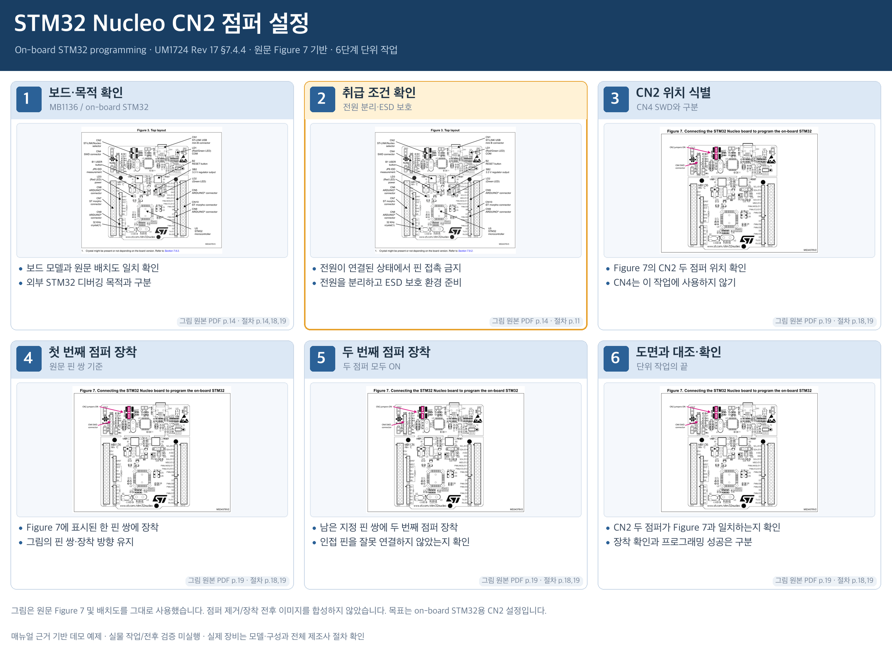

# STM32 Nucleo CN2 점퍼 설정

§7.4.4 본문 및 Figure 7 전체. CN2 점퍼 설정만이며 펌웨어 업로드·실제 프로그래밍 성공은 범위 밖.

## 그림 사용 방식

원문 figure/photo를 그대로 발췌·축소하여 카드에 배치했다. 그림 형상, 배선, LED 상태 및 도구 위치를 변경하지 않았다. 텍스트로 설명하는 동작은 원문 절차를 세분화한 것이며 새로운 작업 사진을 생성하지 않았다.

## 단계별 설명

### 1. 보드·목적 확인 · MB1136 / on-board STM32

- 보드 모델과 원문 배치도 일치 확인
- 외부 STM32 디버깅 목적과 구분

그림: 원본 PDF 14쪽 / 절차: [14, 18, 19]

### 2. 취급 조건 확인 · 전원 분리·ESD 보호

- 전원이 연결된 상태에서 핀 접촉 금지
- 전원을 분리하고 ESD 보호 환경 준비

그림: 원본 PDF 14쪽 / 절차: [11]

### 3. CN2 위치 식별 · CN4 SWD와 구분

- Figure 7의 CN2 두 점퍼 위치 확인
- CN4는 이 작업에 사용하지 않기

그림: 원본 PDF 19쪽 / 절차: [18, 19]

### 4. 첫 번째 점퍼 장착 · 원문 핀 쌍 기준

- Figure 7에 표시된 한 핀 쌍에 장착
- 그림의 핀 쌍·장착 방향 유지

그림: 원본 PDF 19쪽 / 절차: [18, 19]

### 5. 두 번째 점퍼 장착 · 두 점퍼 모두 ON

- 남은 지정 핀 쌍에 두 번째 점퍼 장착
- 인접 핀을 잘못 연결하지 않았는지 확인

그림: 원본 PDF 19쪽 / 절차: [18, 19]

### 6. 도면과 대조·확인 · 단위 작업의 끝

- CN2 두 점퍼가 Figure 7과 일치하는지 확인
- 장착 확인과 프로그래밍 성공은 구분

그림: 원본 PDF 19쪽 / 절차: [18, 19]

## 범위와 해석

- 이 예제는 원문 근거를 보여주는 오프라인 스토리보드다. 실제 장비의 안전/정상 동작을 승인하지 않는다.
- 같은 그림이 여러 카드에 반복되어도 수행 전후 상태라는 뜻은 아니다.
- 원문 PDF 페이지와 발췌 PDF의 페이지는 storyboard-source.json의 page_map으로 구분한다.
- 장비 등록/source_url 검증/실물 평가/9패널 계약 적용/앱 구현 및 통합은 orchestrator 후속 범위다.

- §7.4.4의 단위 작업 전체이며 펌웨어 설치/업로드를 포함한 전체 프로그래밍 절차는 아니다.
- 첫/둘째 점퍼 카드는 원문의 두 점퍼 장착을 설명상 나눈 것이다. 원문에는 먼저 장착할 점퍼 순서가 지정되지 않았다.
