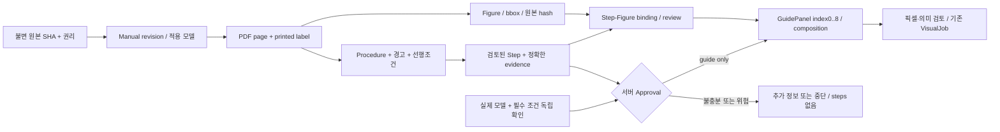

# 매뉴얼 자산화 ADR 제안 — 원본 그림을 보존하는 작은 수직 구현

2026-10-09 KST · 상태 **제안, 공유 계약 변경 아님** · 제품 코드/유료 API/기기 조작 없음.

**권고: 발견한 prework 6개 PDF를 먼저 불변 자산으로 보존하고, Dell R750의 읽기 전용 식별 1건에 검토된 근거와 원본 그림을 연결한다.** 검색 확장은 이후이며, 오늘 파인튜닝은 하지 않는다. 자산 등록은 작업 승인과 별개다. 현재 live guide를 막는 안전 경계를 우회해 그림부터 표시하지 않는다.

## 실제 조사 결과

실제 원본 루트는 `/Users/runixs/working/ai/dsdn-hub/HowLens-prework`이다. 로컬 HEAD `86e87345a11c3386ea7a8fe7d26b1001c63dd48e`와 별개로 작업 파일의 바이트를 직접 검사했다. 공개 `geniuskey/HowLens-prework` main `494d52c5c44c03d34a93f480f9ff179cdf1e35dc`에는 README/PREWORK 2개만 있으므로 원격 clone만으로는 이 자산을 얻을 수 없다.

[INVENTORY.json](INVENTORY.json)에 선택한 109개 파일의 절대경로·SHA-256·크기·이미지 치수와 6개 PDF 페이지 수가 있다. 전체 prework를 조사했다는 뜻은 아니다. PDF 6개 해시 모두 `prework_assets/02_manuals/MANUALS.md`와 일치했다. 선택 파일들은 소유 폴더 `docs/assets/manual-asset-design/private/originals/<sha>/<filename>`에 바이트 그대로 로컬 보관했으며 `.gitignore`로 공개 커밋에서 제외했다. 원본 수정 없음. 이 private 사본은 다른 PC로 git push되지 않는다.

| 원본 상대경로: `prework_assets/02_manuals/` 아래 | 확인한 문서/버전 | 실제 PDF 쪽수 | 현재 Backend catalog와 차이 |
|---|---|---:|---|
| `server/poweredge-r750_Owners-Manual_en-us.pdf` | Dell R750 ISM, December 2024 A11; 표지 확인 | 255 | SHA까지 같음, URL alias만 다름 |
| `cobot/710-965-00_UR5e_User_Manual_en_Global.pdf` | PolyScope 5.23, Document 10.13.387, 710-965-00; PDF244 확인 | 245 | catalog는 5.17/10.5.152/362쪽: 근거 재사용 금지 |
| `ups/APC_SmartUPS_Tower_OperationManual_990-3534H_EN.pdf` | EN 990-3534H, 03/2023; PDF20 확인 | 20 | catalog는 990-6411A, 04/2022: 별도 revision |
| `ups/APC_SmartUPS_Tower_InstallationGuide_990-3535H_EN.pdf` | EN 990-3535H-001, 05/2022; PDF8 확인 | 8 | 신규 문서 |
| `ups/APC_RBC_Battery_Cartridge_Replacement_InstructionSheet_990-0179L_EN.pdf` | 990-0179L, 9/2012; PDF8 확인 | 8 | 신규 문서, SMT1500I에 자동 적용 불가 |
| `ups/APC_RBC_Addendum_PostInstall_ReplaceBatteryLED_990-0374A_EN.pdf` | 990-0374A revision2, 11/01; PDF1 확인 | 2 | 신규 문서, 적용 제외 제품 존재 |

주요 시각 자산: `05_visuals/scenes` PNG 15개는 SCENES.md가 명시한 **AI 합성 입력**; `storyboards` 1254×1254 PNG 3개는 생성 실험; `infographics` 최상위 2048×2048 PNG 3개는 원본 그림/별도 글자/일부 생성 보조 그림의 합성물; 각각 9개 split PNG가 있다. `infographics/illustrations` 3개는 생성 보조 그림이며 제조사 근거가 아니다. manual/photos JPG 6개도 실제 이번 장비 사진이 아니다: R710/Sun/UR5/구형 UPS 등 모델 대용 사진이 포함된다. GPS 등 원본 metadata를 공개하지 않는다.

`info_server_psu.png`와 PDF211을 직접 열어 확인했다. 사전 자료의 **3×3=9패널**이며 9×9=81작업이라는 근거는 없다. 현재 계약도 index0–8이다. 원본 요청 표현은 기록하되 81개로 확장하지 않는다. 사전 9단계 문구를 현재 1–9개 승인 단계 제한에 맞추려고 강제로 분할하지 않는다.

prework PROMPTS.md와 storyboard.md v2의 의도는 이미 명확하다: 매뉴얼 그림이 있으면 원본 합성, 없을 때만 보조 생성, 한국어/표식은 별도 레이어. 이를 제품 요구로 계승한다. 사전 seed의 역할·코드·안전 필드는 현재 계약을 대체하지 않는다. 기존 생성편집 결과의 픽셀 변형 수치는 RESULTS.md의 과거 실험 보고이며 이번에 재실행하지 않았다.

## 현행 구현과 정확한 간극

읽은 불변 기준: Backend `d167c43`, Visual `5dcf6f2`. 이후 변경은 이 감사에 자동 포함하지 않는다.

- `backend/howlens/manual_sources.json`: 3문서의 발췌 5건. 모두 `supported_actions=[]`. 문서를 찾았다고 실행 가능한 절차가 생기지 않는다.
- `manual_catalog.py`: 공식 URL allowlist, hash 형식, 리뷰 문자열 등을 검사한다. runtime에 PDF 바이트와 quote를 다시 대조하는 ingestion 엔진은 아니다. 신뢰된 offline 등록 책임이 남는다.
- `openai_provider.py`: 선택 장비의 등록 발췌를 모두 전달하며 page/image 검색은 없다. `conservative_review()`가 빈 `Approval()`을 반환하므로 현재는 독립 확인된 live guide 승인 채널이 없다.
- `safety.py`: 근거의 정확한 필드, action 문자열, approved_steps, 필수 조건을 검사한다. 모델이 만들어 낸 승인으로 대체하면 안 된다.
- `backend/visual/service.py`: step description만 prompt에 들어가고 `_scene_steps`는 승인 단계를 9칸에 반복 매핑한다. figure/문서 버전/원본 crop을 전달하는 경계가 없다.
- `visual/openai_provider.py`: text-only `/images/generations`; reference edit 입력 없음. 금지 프롬프트만으로 부품 형태 보존을 증명하지 못한다.
- `splitter.py`: 크기·PNG·9등분 geometry 검증. 형상/부품/동작/근거의 의미 검증이 아니다. 기존 prework는 배너·gutter가 있으므로 2048 PNG를 이 splitter에 바로 넣을 수 없다(2048은 3으로 나누어떨어지지도 않음).

## 선택지와 오늘의 결정

| 방법 | 얻는 것 | 비용/한계 | 오늘 |
|---|---|---|---|
| curated catalog + source figure sidecar | 정확한 버전, 검토한 action, 재현 가능한 그림 | 수동 검토량 제한; 현재 Approval 공백 해결 필요 | **선택**, 1문서/1읽기 전용 절차 |
| page+figure retrieval (RAG) | 더 많은 문서에서 후보 근거 검색 | chunk/표/선행조건 연결, 모델 버전 필터, 검색 품질 평가 필요 | 자산 구조만 준비, 확대는 후속 |
| fine-tuning | 반복 형식/행동 학습 가능성 | 권리·학습셋·비용·검증 필요, 원문 수정 반영/출처/픽셀 보존 해결 아님 | 오늘 제외 |

RAG는 외부 자료 검색을 기존 모델에 제공하는 방식이며 인덱싱은 가중치 훈련이 아니다. 구조 기반 chunk는 절차와 경고를 함께 보존하는 데 적합하다는 공식 설명이 있다. 오늘 6문서에는 JSON catalog와 로컬 키워드/FTS만으로 후보 선택을 시작할 수 있으며 embedding API가 필수는 아니다. [Microsoft Document Intelligence v4 GA RAG 설명](https://learn.microsoft.com/en-us/azure/ai-services/document-intelligence/concept/retrieval-augmented-generation?view=doc-intel-4.0.0), [Azure AI Search RAG](https://learn.microsoft.com/en-us/azure/search/retrieval-augmented-generation-overview).

## 자산 graph 및 내부 sidecar 제안

JSON/SQLite로 시작; 그래프 DB 불필요. 각 노드 공통 필드: stable ID, revision, content_sha256, created_at, derived_from, rights_status, review_status, reviewer, reviewed_at, supersedes. `inventory_verified`, `source_verified`, `action_reviewed`, `field_approved`는 구분하며 하나의 reviewed boolean으로 합치지 않는다.

- Manual: 제조사/정확한 모델·SKU/지역·전압/하드웨어 revision/firmware 범위, 원본 URL와 최종 URL, 수집 시각, hash/bytes, 문서 edition, 언어, 라이선스·허용 사용 범위. 버전 모름은 wildcard가 아니다.
- Page: `pdf_page` 1-based, `printed_page` nullable string, rotation, MediaBox/CropBox, text hash. 인쇄쪽 offset을 문서 전체에 무조건 적용하지 않는다.
- Figure: page ID, figure number/caption, xref(해당 PDF revision에서만 의미), bbox `[x0,y0,x1,y1]` in points / top-left / rotation0, pixel 원본 크기, crop 좌표, renderer 및 버전. embedded image면 원본 stream 추출을 우선, 벡터/표/복합 그림이면 page clip render. 원본과 파생 렌더의 hash를 별도 기록. [PyMuPDF 이미지/clip 공식 문서](https://pymupdf.readthedocs.io/en/latest/recipes-images.html).
- Procedure: 원래 순서, 경고, 모든 필수 전제, 적용 범위. 경고는 근처 chunk가 아니라 명시 관계로 연결; 중간 작업만 검색되어도 전체 전제가 동반된다.
- Step: 정확한 승인 문구와 한 개 이상 evidence ID, 금지 변형, 필요한 field confirmation. 도해와 절차가 다른 페이지일 수 있다.
- Binding: step ID + figure ID + 용도(context/action/detail) + 일치 검토. 그림이 비슷하다는 이유로 action_support=true 금지.
- Panel: 승인된 step ID, source figure ID, transform/overlay, figure와 action의 각 출처, renderer version, 출력 hash, 의미 review. 다중 패널이 같은 step을 보여도 새 행동을 만들지 않는다.

selector는 문서의 특정 영역/텍스트를 지목하고 본문과 분리하는 구조를 따른다. W3C annotation selector 모델을 참고하되 JSON-LD 전체 도입은 필요 없다. [W3C Web Annotation Data Model](https://www.w3.org/TR/annotation-model/#selectors).

## 검색·미등록 제품 발견

등록 자료 검색: 모델+SKU+firmware+언어+문서 revision+rights/review 상태로 **먼저 필터**, 질문/관찰을 안전한 query 데이터로 정규화한 뒤 section/caption/action 키워드 검색, top3 procedure를 후보로 반환. 두 버전 내용을 혼합하지 않으며 동점·사진/선택모델 충돌 시 모델 라벨/화면 버전을 다시 요청한다. 모델 confidence는 승인 신호가 아니다. quote는 page에서 정확히 확인하고 OCR 텍스트는 원본 영역과 연결해 검토 전 격리한다.

사용자 추가 요청인 **DB에 없는 제품 사진 → 빠른 공식 웹 탐색**은 별도 discovery 계층으로 둔다:

1. 사진의 제조사/모델 라벨을 후보로 추출한다. 부분 문자·동형 모델·시리얼번호는 구분한다. serial은 검색 query에 보내지 않는다. 외형만으로 모델 확정 금지.
2. 공식 제조사 도메인 registry로만 검색한다. Coordinator가 12:48 KST 전달한 확정 discovery budget: 전체30초, 최대2 REST attempts(공유 ledger), 동시2 slots, cache16/hash-only, 후보≤3, no automatic guide approval. 자산 다운로드 후속 제안은 문서1개/최대60MiB/최대500쪽이며 discovery 응답 경로와 분리한다. 검색 실패·접근 제한은 정상 needs_more_information 경로다. Backend가 별도 discovery 구현을 맡는다. 제공자 호출의 유료 권한·설정은 해당 담당자가 관리하며 본 연구는 유료/검색 모델 API 호출0이다.
3. 결과는 `candidate → downloaded → hash/page verified → rights reviewed → action reviewed`로 격리한다. 제조사 title/snippet을 문서 근거로 즉시 승격하지 않는다. 리다이렉트 매 hop HTTPS/domain 검증, private/link-local IP 차단, 임의 사용자 URL fetch 금지, PDF parser 자원 제한. 제조사 링크의 S3도 정확한 소유 연결을 확인한다.
4. 캐시는 Coordinator가 확정한 hash-only 최대16 후보 entry와 원본(content-addressed, immutable)을 분리한다. TTL/eviction은 Backend 구현에서 확정하고 원본 이미지·serial은 query cache에 저장하지 않는다. URL 바이트가 바뀌면 새 revision으로 저장하고 이전 승인 binding을 무효화한다.
5. 현재 API `device_id`는 server/cobot/ups뿐이다. **미등록 제품을 임의로 server로 위장하면 안 된다.** Coordinator가 별도 additive `POST /product-discoveries`를 확정했다(12:48 전달, 아직 이 문서 작성 시 common 파일은 초기 snapshot). multipart photo + optional question≤2000/model_hint≤200; 응답 discovery_id, status(candidate|needs_more_information|not_found), candidates≤3{manufacturer,model,summary,sources≤3{title,url,retrieved_at},match_notes}, missing_information,mode이다. 이 경로는 기존 Analysis.device_id enum을 확장하지 않는다. App은 후보 목록과 실제 citation을 보여주고 검토된 catalog 등록 전까지 작업 안내로 연결하지 않는다. 후보 발견을 `guide`로 내보내지 않는다.

## 시각 fidelity와 승인 기준

1순위 **정확한 source image + 결정적 합성**. 원본 stream은 byte-identical 보관, 화면 scale은 종횡비 유지/letterbox, 텍스트는 그림 바깥. 표식은 별도 레이어로 지시 대상만 둘러싸며 커넥터·배선·원문 라벨을 새로 그리지 않는다. 원본 그림이 제거 방향을 보이는데 삽입 설명에 사용하는 오류를 금지한다.

기계 검증: 원본 SHA100% 일치; 선언된 transform/overlay를 적용한 golden 렌더와 출력 비교; overlay 밖 픽셀은 같은 renderer golden과100% 일치(리사이즈 결과를 원본 픽셀과 직접 비교하지 않음); 비율 오차≤0.1%; clipping0; step/evidence/figure 참조100%; 캐시 키에 원본/절차 revision 포함.

의미 검증: 승인자가 부품 개수·포트 위치·연결 topology·방향 화살표·라벨 글자·색상 의미를 원문과 대조한다. critical mismatch **0건**, target bbox 검토 위치와 IoU≥0.9(제안 검사값, 안전 증명 아님), 원문 필수 라벨 누락0, 새 작업0. 9칸 geometry PASS를 의미 PASS로 기록하지 않는다. AI similarity/SSIM/OCR 점수만으로 통과 금지.

reference edit/generation은 후순위다. 원본이 없는 칸에서만 reference ID를 남긴 **보조 설명**으로 별도 분류하고 사람이 검토한다. 생성물은 근거가 되지 않으며 허구 커넥터·배선·글자가 있으면 실패한다. today 유료 호출0; 누락된 그림은 verified text 유지 또는 VisualJob failed. 기존 prework 합성물의 ‘정상’ 같은 문구도 현재 verification의 제한 표현으로 재검토한다.

## 오늘 최소 구현 작업: 담당자에게 넘길 카드

예상치는 구현/검토 가능한 실제 인력·장비에 따라 달라지는 상한 제안이다. 14:30 freeze 전에 독립 확인이 안 되면 새 live guide 출시 대신 자산 패키지와 실패 경로를 인계한다. 실제 작업 승인을 얻기 위해 일정 때문에 조건을 낮추지 않는다.

| 순서/Owner | 대상 파일(제안, 본 작업에서 수정 안 함) | 범위/예상 | 의존성·acceptance | rollback |
|---|---|---|---|---|
| A Evaluation | 소유 evaluation 자산 manifest/fixture | Dell A11 1개 식별 procedure와 p11/p245 근거, figure binding 검토 20–30분 | 실제 R750 label/photo·촬영 권한, 사진은 읽기만, 모델·버전 match; hash/페이지 불일치 negative | manifest revision 비활성화 |
| B Backend | `backend/howlens/manual_catalog.py`, `manual_sources.json`, 새 `manual_assets.py`, 테스트 | sidecar lookup + trusted exact action registration 30–45분 | A, 원본 rights와 action 검토; 기존 Approval 유지, 확인 출처 없으면 needsinfo | 이전 catalog/flag OFF |
| C Visual | `backend/visual/service.py`, 새 `manual_compositor.py`, 테스트 | approved step→등록 figure resolver→1536×1536 borderless grid(512칸) 30–45분 | B sidecar; basename/ID allowlist, fixed9cells, scene mapper와 같은 step 순서, 모델 호출0, literal/new action0 | compositor OFF, 이미지 failed+텍스트 유지 |
| D Backend/Coordinator | `openai_provider.py` review boundary / 공유 계약은 별도 ADR | 독립 장비·전제 확인 provenance 채널 결정 20–30분 이상 | 실제 검증 주체/입력 위조 방지; 빈 Approval을 무조건 true로 변경 금지 | 기존 보수적 review |
| E App/Evaluation | 기존 VisualJob/Evidence 표시, 회귀 tests | 20–30분 | API 키/DTO 그대로, 출처 페이지 확인, 실패 시 승인 텍스트 보존, mock/live 표시 | 기존 UI |

A는 **읽기 전용 전면 패널 식별**만 제안한다. Figure212 PSU 제거 표본은 pipeline 검증용이며 A에 잘못 붙이지 않는다. PSU 교체·UR 재시작·UPS 배터리 교체는 오늘 검토 범위 밖이다. 새로운 physical confirmation HTTP 채널이 없으므로 D는 별도 결정과 검증이 필요한 blocker다. 미승인 관찰 자료를 guide 화면에 보이게 우회하지 않는다.

HTTP 계약은 유지한다: Analysis.evidence/steps, VisualJob.panels index0–8, same-origin `/visual-assets/...` 그대로. figure IDs는 서버 sidecar로 resolver에 전달하고 클라이언트가 임의 경로/원문/새 절차를 넣지 못하게 한다. 기존 `generate_storyboard(analysis:dict)->bytes`를 유지하려면 startup에 immutable resolver/compositor를 설정한다. 분석 snapshot에 asset-manifest revision을 내부 보관하여 재시도와 캐시가 다른 문서로 바뀌지 않게 한다. 권리상 출력 불가면 Visual failed.

## 검증 및 보류

실행 완료: 109개 source hash/치수 inventory, 6PDF 재해시·parse·private copy, Figure212 재추출 hash와 prework 원본 동일성, 선택 PDF render/육안 비교. 소유 문서만 변경. 제품 tests·paid AI·실장비 평가·작업 안전 승인·이미지 재생성은 **미실행**.

필수 후속 검증: wrong-model/R710, UR5.17↔5.23, 같은 URL의 다른 hash, PDF↔인쇄쪽 혼동, warning-only 누락, injected quote, unsupported action, figure removal↔insertion, missing rights, crop cut connector, 9칸이지만 step mismatch, revoked revision, no network, image fail preserving text. 각 경우 steps 제거/needsinfo/stop/visual failed가 맞게 분기되어야 한다.
